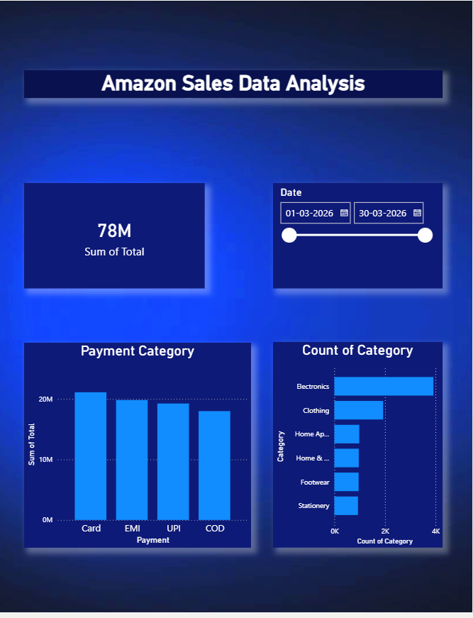

# Amazon Data Analysis Dashboard

## 📊 Project Overview
This project analyzes Amazon sales data using Power BI and Excel.
It provides insights into sales performance, profit trends, and customer behavior.

## 🛠 Tools Used
- Power BI
- Microsoft Excel

## 📸 Dashboard Preview

## 📂 Files Included
- Data Analysis Project 01.pbix
- Data Analysis Project 01.xlsx

## 📈 Key Insights
- Sales trends analysis
- Profit distribution
- Customer behavior insights
